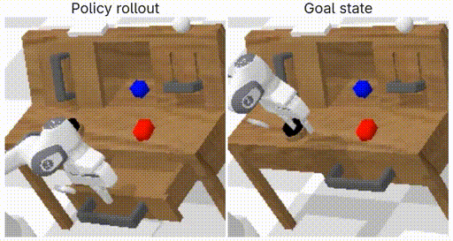

# Learning latent plans from play

This repo is an implementation the self-supervised policy learning methods Play-GCBC and Play-LMP (as described in the paper by Lynch _et al._ [[1]](#1)), including a script to train policies on play datasets from the CALVIN benchmark [[2]](#2).

The GIF below shows a trained Play-LMP policy [executing a series of tasks](#running-a-trained-policy) in CALVIN environment D.
By passing different goal states as inputs, a single policy is able to solve multiple tasks:
grasp and displace blocks, open and close the drawer/cabinet, push the button and turn on the light by flipping the switch.
We also observe emergent "retrying" behavior, where the policy will re-attempt a task if it fails in its first try (in the GIF, for example, when grasping blocks and when trying to open the drawer).

<p align="center">
  
</p>

The implementation uses state-based observations and goals (as opposed to images in the original paper), so there is no CNN backbone.

## Installation and training

First, clone the repo:

```shell
git clone https://github.com/jongoiko/play-lmp.git
cd play-lmp
```

Then install [`calvin_env`](https://github.com/mees/calvin_env) and its dependencies:

```shell
git clone --recursive https://github.com/mees/calvin_env.git
cd calvin_env
touch __init__.py
uv pip install -e .
cd ..
```

We now need to download the training dataset, e.g. for the CALVIN environment D (note that this split is 166 GB, so it will take some time to download):

```shell
git clone https://github.com/mees/calvin.git
cd calvin/dataset
sh download_data.sh D
cd ../..
```

We can now start training a policy.
All hyperparameters are stored in `conf/config.yaml` and read using [Hydra](https://hydra.cc/).

```shell
uv run train.py
```

Metrics will be logged to TensorBoard.

## Running a trained policy

Once a policy has been trained, we can execute it on the CALVIN environment to solve a variety of tasks:
see the `run_policy.ipynb` notebook, which can be run on JupyterLab with

```shell
uv run --with jupyter --with matplotlib --with mediapy jupyter lab
```

Since in this implementation the policy uses state-based observations, we would not expect to see generalization to different environments (e.g. A, B, C $\rightarrow$ D, as proposed in the CALVIN paper).
However, it would be interesting to test this generalization when training the policy on image-based observations.

## Resources and references

<a id="1">[1]</a>
Lynch, Corey, et al. "Learning latent plans from play." Conference on robot learning. PMLR, 2020.

<a id="2">[2]</a>
Mees, Oier, et al. "CALVIN: A benchmark for language-conditioned policy learning for long-horizon robot manipulation tasks." IEEE Robotics and Automation Letters 7.3 (2022): 7327-7334.

[Giulio Starace's post explaining the Discretized Logistic Mixture Likelihood](https://www.giuliostarace.com/posts/dlml-tutorial/), used for parameterizing the policy's action distribution.
